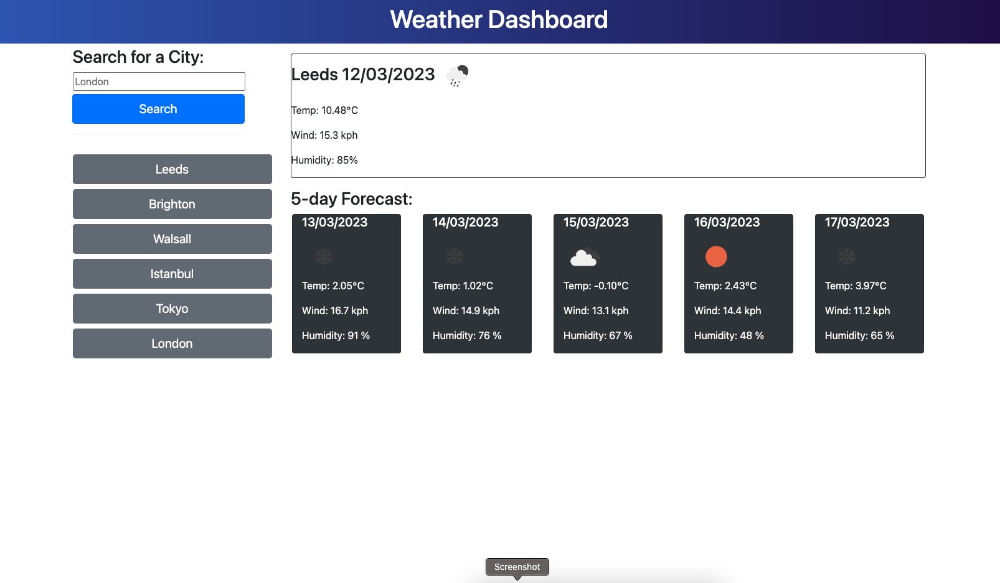
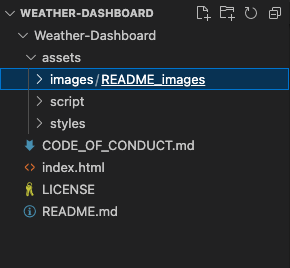

# Weather-Dashboard  

## Description
This Weather Dashboard Project was created as part of the Bootcamp course with EDx. This uses a openweather 5 Day Weather Forecast API to create a weather dashboard from the Users form inputs, Using HTML and Javascript with JQuery.

When the user searches for a city they are presented with current and future conditions for that city and that city is added to the search history button area, Once the button is clicked on a city in the search history they are again presented with the weather data from this time

https://tjhandson.github.io/Weather-Dashboard/

# Installation

## Web browser - Chrome
To View the finished webpage downloading a Web browser, such as google chrome, is recomended. Please find the link too download below: https://www.google.co.uk/chrome/?brand=YTUH&gclid=EAIaIQobChMI5pKQxIr2-wIVwp7tCh3CoA27EAAYASAAEgI4jfD_BwE&gclsrc=aw.ds

With the instalation process noted below: https://support.google.com/chrome/answer/95346?hl=en-GB&co=GENIE.Platform%3DDesktop

## Git
It is recomented to download Git if you are looking to interact with this public repo, Details on downloading this can be found here: https://github.com/git-guides/install-git

## VS Code
Visual Studio Code is a source-code editor (there are others available), The download for this cn be found on; https://code.visualstudio.com/download

# Usage
This is a public repo and available to be run on either a webrowser or locally.

## Run on Web browser (Chrome recommended for acccess to Console)
Follow the link on: https://tjhandson.github.io/Weather-Dashboard/

To access the console in Chrome Browser use this keyboard shortcut: "Cmd + Option + J" (on a Mac) or "Ctrl +Shift +J" (on Windows).
However, alternatively right-click on the webpage and click "Inspect" to open the developer console and slecet the "Console" tab within this tab

## Run Locally

Clone project
git clone git@github.com:tjhandson/Weather-Dashboard.git

Once downloaded the follow assets should be available within this folder:

## Credits

All taught and Source material were provided by © 2022 edX Boot Camps LLC.

## License

MIT License 2022 Please refer to the LICENSE in the repo.

## Contributing

Firstly, thanks for taking the time to contribute! We are happy for any contributions to this repo, with raising issues or reporting bugs.
Please remain respectful to any community members inline with our code of [conduct](code_of_conduct.md) 
All taught and Source material were provided by © 2022 edX Boot Camps LLC.

Solution to adding CSS elements added to classes and ID was https://stackoverflow.com/questions/30080207/how-to-set-margintop-to-the-div-using-jquery-or-javascript-for-ie8.
Funtionality of Calling API was infromed by the coding perfromed in the Projects Application week.

---

© 2022 edX Boot Camps LLC. Confidential and Proprietary. All Rights Reserved.